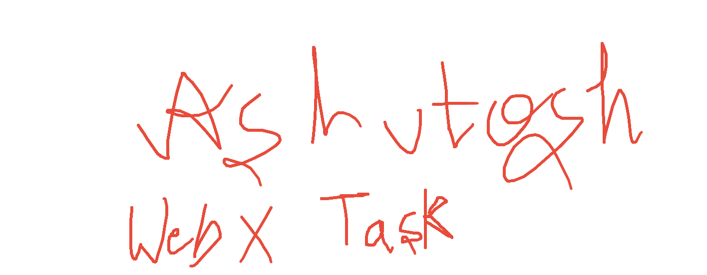

 🎨 Personal Whiteboard Web App - CGS Task

 
*(Replace this link with your actual GitHub Pages link if it's different!)*

*(**Important**: Add a screenshot of your app to your `assets` folder and name it `screenshot.png` for the image above to work!)*

## 📋 About The Project

This web application provides a clean, digital canvas right in your browser. The goal was to create a drawing experience using  web development, focusing on the HTML Canvas API to handle the drawing logic.

## ✨ Features Implemented

*(Edit this list to reflect the features you actually built!)*
* **Free-form Drawing:** Smooth drawing on the canvas with the mouse.
* **Color Picker:** Ability to change the stroke color.
* **Brush Size Control:** A slider or buttons to adjust the thickness of the brush.
* **Eraser Tool:** An eraser to remove parts of the drawing.
* **Clear Canvas:** A button to reset the entire whiteboard.
* **Save as Image:** (Bonus Feature) A button to download the current drawing as a `.png`.

## 🛠️ Tech Stack

This project was built using fundamental web technologies, without any external frameworks.
* **HTML5:** Structured the content and the `<canvas>` element.
* **CSS:** Styled the user interface for a clean and modern look.
* **JavaScript:** Powered all the interactive features, including:
    * DOM Manipulation
    * Implementing the core drawing logic using the **HTML Canvas API**.

A special thank you to the **Computer Graphics Society, IIT Kharagpur**, for providing this excellent learning task and opportunity.
